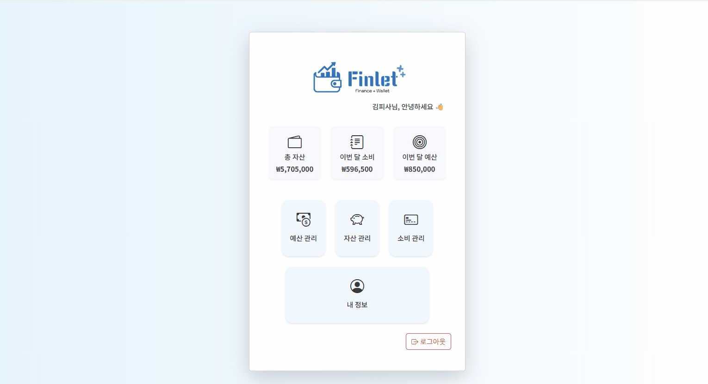

# 🌟 Personal Project Portfolio

안녕하세요! 👋

제가 직접 탐구하고, 기획하고, 설계하고, 개발한 프로젝트들을 모아둔 저장소입니다.
도전해보고 싶은 아이디어를 실제로 구현하며 성장한 결과물들을 한눈에 확인할 수 있습니다.

- 최종 업데이트일: 2026-01-19

---

## ✨ Featured Projects

| 프로젝트 이름   | 이미지                                  | 설명                                    | 기술 스택                                                                                                                                                                                                                                                                                    | 링크                                      |
|---------------|-------------------------------------|---------------------------------------|------------------------------------------------------------------------------------------------------------------------------------------------------------------------------------------------------------------------------------------------------------------------------------------|-------------------------------------------|
|TrendSpot| 소상공인을 위한 스마트 창업 인사이트 플랫폼: 민간 카드사의 소비 데이터를 바탕으로, 시군구 및 행정동 단위에서 업종별 소비 패턴을 분석 |  |                                                                                                  |[🔗 바로가기](https://github.com/ddddabi/TrendSpot/tree/main)|
|Finlet| 3-Tier 기반의 개인 금융 관리 시스템(가계부)으로 JWT, Spring Security 등 보안 적용 |   |      |[🔗 바로가기](https://github.com/TierGuardians)|
|Privideo| 하이브리드 클라우드 기반 동영상 스트리밍 공유 플랫폼 |   |       |[🔗 바로가기](https://github.com/AllStackProject)|

---

## 💻 Applications

| 프로젝트 이름 | 설명                                          | 기술 스택    | 링크                                                                                               |
|------|---------------------------------------|--------------|--------------------------------------------------------------------------------------------------|
| Vibecap | 현장 사진 및 데이터 기반 실시간에 어울리는 음악 playlist 추천 서비스 |             | [🌐 Team](https://github.com/Vibecap)   [🔗 바로가기](https://github.com/ddddabi/Vibecap_Android) |
| Arearius | 개인정보유출방지를 위한 정적 분석 보안 점검 안드로이드 어플리케이션 개발    |             | [🔗 바로가기](https://github.com/ddddabi/arearius)                                                   |
| 다다익선: 건강의 모든것 | Kotlin 기반 식단, 운동 기록 어플리케이션                  |             | [🔗 바로가기](https://github.com/ddddabi/GURU2_project)                                              |
| Zombie Bomb | Unity 기반 3D FPS 게임 개발                       |                | [🔗바로가기 ](https://github.com/ddddabi/GURU_Unity_15)                                              |
| 설문 ZIP | 대학생 설문조사 공유 웹/앱 서비스, 설문 ZIP                |                                            | [🌐 Team](https://github.com/umc-moamoa) [🔗 바로가기](https://github.com/ddddabi/MOA_WEB)        |

---

## 🛡️ Security

| 프로젝트 이름            | 설명                               | 기술 스택 | 링크                                      |
|----------------------|----------------------------------|---|-------------------------------------------|
| Whitehat School vulhub 한글판     | vulhub 을 기반으로 한국어 번역 및 컨텐츠를 추가하는 것을 목표로 공동작업 | - | [🔗 바로가기](https://github.com/ddddabi/whitehat-school-vulhub)|

---

## ⚙️ Automation

| 프로젝트 이름           | 설명                         | 기술 스택 | 링크                                      |
|-------------------|----------------------------|--------|-------------------------------------------|
| pipc news bot     | 개인정보보호위원회 동향 파악 업무 자동화 시스템 |  | [🔗 바로가기](https://github.com/ddddabi/pipc_news_bot) |
| overseas news bot | 국외뉴스 RSS 기반 수집 자동화 시스템     | | [🔗 바로가기](https://github.com/ddddabi/overseas_news_bot) |

---

## Data
| 프로젝트 이름           | 설명                         | 기술 스택                                                                                                                                                                                                                                                                                                       | 링크                                      |
|-------------------|----------------------------|-------------------------------------------------------------------------------------------------------------------------------------------------------------------------------------------------------------------------------------------------------------------------------------------------------------|-------------------------------------------|
|카드연구소|실제 카드 소비 데이터를 기반으로 한 신용카드 상품 기획을 위한 데이터 시각화|     | [🔗 바로가기](https://github.com/ddddabi/card-analytics-lab)|

---
## 📖 Studying

| 프로젝트 이름                        | 설명                 | 기술 스택 | 링크                                      |
|--------------------------------|--------------------|--------|-------------------------------------------|
| SeatHelper                     | 자바 기반 자리 랜덤 배치 프로젝트 |  | [🔗 바로가기](https://github.com/ddddabi/FISA_SeatHelper/tree/main) |
| java-lotto-7                   | 자바 기반 로또 프로그램      |  | [🔗 바로가기](https://github.com/ddddabi/java-lotto-7) |
| java-racingcar-7               | 자바 기반 자동차 경주 프로그램  |  | [🔗 바로가기](https://github.com/ddddabi/java-racingcar-7) |
| java-calculator-7              | 자바 문자열 덧셈 계산기      |  | [🔗 바로가기](https://github.com/ddddabi/java-calculator-7) |
| Property-management-system-PMS | 단말 자산 관리 시스템 설계 학습 |  | [🔗 바로가기](https://github.com/ddddabi/Property-management-system-PMS) |

<!--
## 🏗️ Architecture & System Design

| 프로젝트 이름                  | 설명                       | 기술 스택 | 링크                                      |
|--------------------------|--------------------------|--------|-------------------------------------------|

---
-->

## 📫 Contact

